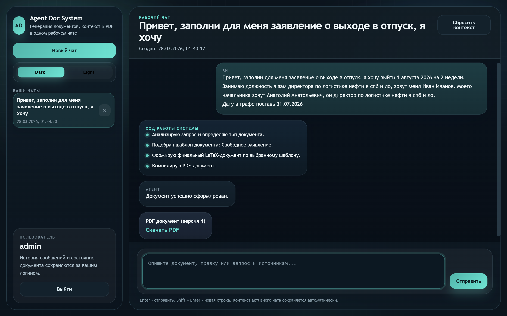
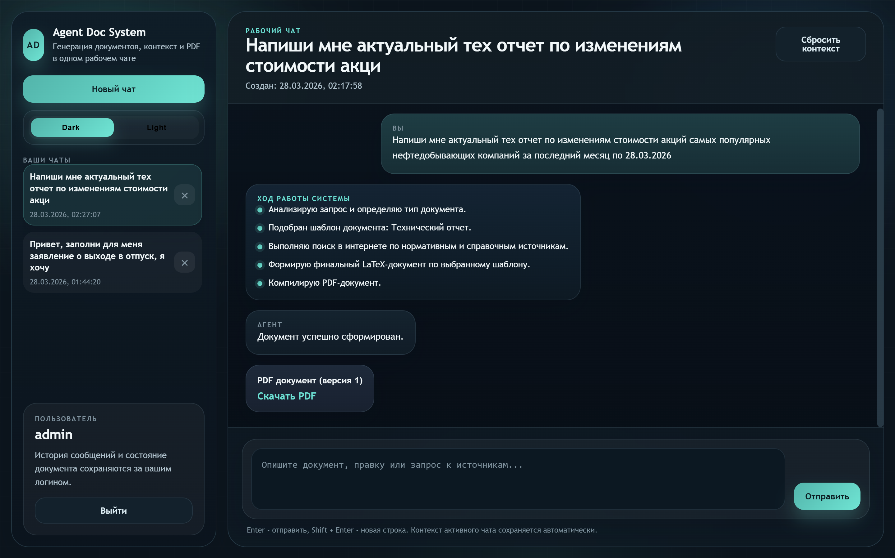
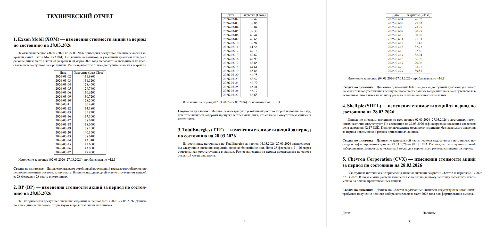
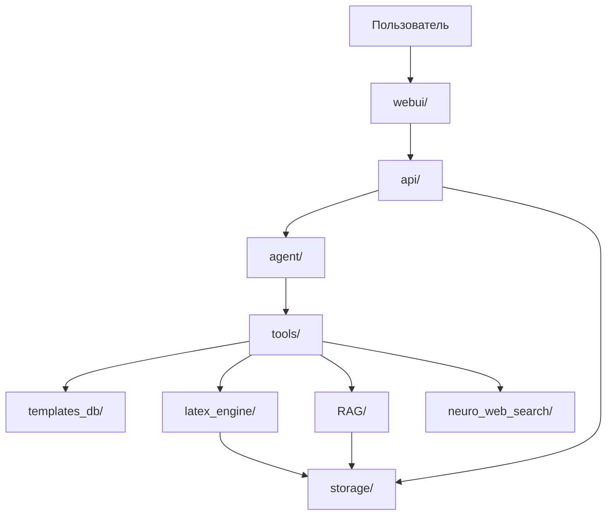

# Agent documentation system

Агентная система автоматизированной подготовки технической документации и отчетности на основе корпоративной базы знаний

## 📖 Overview

**Agent documentation system** - это агентная система подготовки корпоративной документации и отчетности с веб-интерфейсом, которая объединяет LLM-оркестрацию, шаблонную генерацию на LaTeX, RAG и нейро-веб-поиск. Пользователь формулирует запрос-задачу на естественном языке, а система сама определяет тип документа, подбирает шаблон, собирает недостающий контекст из внутренних и внешних источников и формирует готовый PDF-документ.

Проект включает:
- **Агента-оркестратора**, который управляет сценарием обработки запроса;
- **Базу шаблонов документов** и инструменты генерации LaTeX/PDF;
- **Retrieval-Augmented Generation (RAG)** по специализированной базе знаний, включающей нормативно-техническую документацию (ГОСТ, СТО, регламенты);
- **Нейро веб-поиск** для получения актуальной информации из интернета;
- **Веб-приложение** с чатовым интерфейсом, хранением истории и возможностью итеративного редактирования документов.

На выходе система формирует полностью готовый PDF-документ, соответствующий выбранному шаблону и содержащий структурированное содержимое, основанное на извлечённом контексте.

Система поддерживает итеративный режим работы: пользователь может вносить правки в рамках диалога, после чего агент повторно выполняет генерацию с учётом новых условий, сохраняя контекст предыдущих шагов.

Основное назначение проекта - автоматизация подготовки формализованной документации с одновременным обеспечением соответствия нормативным требованиям и снижением нагрузки на сотрудников.

---

## 📢 Demo

  
  
  

Подробные примеры и тесты работы системы доступны в файле:


📄 [demo_agent_doc.pdf](demo/demo_agent_doc.pdf)

📄 [full_demo_agent_doc.pdf](demo/demo_agent_doc_v2.pdf)

В демонстрации показаны:
- генерация различных типов документов (заявления, отчёты, служебные записки);
- использование нормативной базы знаний при формировании текста;
- работа с веб-поиском для получения актуальной информации;
- редактирование и повторная генерация документов в рамках одного диалога.

## Quick start (setup and launch)


### 🔑 API ключи

<table>
  <tr>
    <th>Сервис</th>
    <th>Назначение</th>
    <th>Как получить</th>
  </tr>
  <tr>
    <td><b>OpenRouter</b></td>
    <td>Доступ к LLM (агент, RAG, генерация)</td>
    <td><a href="https://openrouter.ai/">openrouter.ai</a></td>
  </tr>
  <tr>
    <td><b>SerpAPI</b></td>
    <td>Веб-поиск (Google Search API)</td>
    <td><a href="https://serpapi.com/">serpapi.com</a></td>
  </tr>
</table>

> Далее заполнить их в .env файл (см .env.example)


### 🔧 Зависимости и инстурменты
**Python 3.11** и выше.  
1. #### Установка Tectonic LaTeX компилятора
>Tectonic устанавливается через scoop, поэтому предварительно нужно выполнить:

Установка scoop
```PowerShell
%PowerShell
Set-ExecutionPolicy RemoteSigned -Scope CurrentUser
irm get.scoop.sh | iex
```
Установка Tectonic
```bash
scoop install tectonic
```

2. #### Установка requirements
  ```bash
  pip install -r requirements.txt
  ```


### ⚙️ Запуск сервера
```bash
uvicorn api.main:app --port 8000
```


## 🧩 Архитектура и реализация системы

### Структура проекта



Где что находится:
- `agent/` - агент-оркестратор, схемы состояния, промпты и логика обработки пользовательских запросов;
- `api/` - FastAPI-приложение, маршруты, схемы API и сборка серверного слоя;
- `webui/` - чатовый интерфейс, HTML-шаблоны, стили и клиентская логика;
- `templates_db/` - база шаблонов документов (`meta.json` + `template.tex`);
- `tools/` - адаптеры инструментов, через которые агент работает с шаблонами, RAG, веб-поиском и LaTeX;
- `latex_engine/` - рендеринг и компиляция `.tex` в `.pdf`;
- `RAG/` - локальная retrieval-подсистема и связанные артефакты индексации;
- `neuro_web_search/` - подсистема интернет-поиска, парсинга страниц, ранжирования и генерации ответа;
- `storage/` - сгенерированные документы, временные файлы и состояния сессий;
- `requirements.txt`, `README.md` - зависимости и документация проекта.

---

### Агент и инструменты

Агент представляет собой LLM-ориентированный оркестратор, принимающий решения о том, какие действия необходимо выполнить для формирования документа.

После получения запроса агент:

* анализирует пользовательский ввод;
* определяет тип документа;
* выбирает соответствующий шаблон;
* формирует план действий;
* вызывает необходимые инструменты.

В рамках работы агент использует следующие инструменты:

* обращение к RAG для извлечения информации из базы знаний;
* вызов веб-поиска для получения актуальных данных;
* генерация текстового содержимого документа;
* формирование LaTeX-кода;
* компиляция PDF;
* повторная генерация документа при внесении правок.

---

### 🔎 Нейро веб-поиск

Используется для получения актуальной информации из интернета.

Агент формирует список поисковых запросов, которые передаются в SerpAPI (Google Search API). Далее:

* извлекаются результаты поиска (URL, заголовки, сниппеты);
* загружается содержимое страниц;
* выполняется очистка HTML;
* текст разбивается на фрагменты (чанки с наплываами);
* вычисляются эмбеддинги (Sentence-embeding);
* выполняется семантическое ранжирование.

Для отбора наиболее релевантных фрагментов используется cross-encoder + MMR. В результате формируется четкий ответ по запросу, который передается агенту для дальнейшей генерации.

---

### 📚 RAG-система

RAG-подсистема обеспечивает извлечение информации из локальной базы знаний, включающей нормативно-технические и корпоративные документы.

#### Индексация

PDF-документы проходят предварительную обработку:

* парсинг-извлечение текста (с OCR);
* восстановление структуры;
* обработка таблиц;
* очистка от артефактов.

Документы сохраняются в структурированном JSON-формате с постраничным представлением.

#### Секционирование

Для более ориентирорванного поиска по базе знаний - документы разбиваются на смысловые разделы на основе:

* заголовков;
* нумерации;
* структурных признаков.
> При отсутствии явной структуры используется fallback-разбиение на окна страниц.

Далее, для каждого раздела происходит его суммаризация с помощью LLM модели. Это необходимо для оптимизированного поиска ответа на запрос сначала по секциям, а потом по чанкам. 

#### Чанкинг

Разделы разбиваются на небольшие текстовые фрагменты (чанки):

* размер: ~300 токенов;
* перекрытие: ~50 токенов.

При тестировании, было выявлено, что такие параметры обеспечивают наилучший баланс между точностью поиска и сохранением контекста.

#### Эмбеддинги и индексы

Для всех чанков и секций вычисляются эмбеддинги с использованием модели BAAI/bge-m3.
Данные сохраняются в FAISS-индексах:

* индекс секций;
* индекс чанков.

#### Retrieval pipeline

Поиск выполняется в несколько этапов:

1. Поиск релевантных секций;
2. Уточнение на уровне чанков;
3. Восстановление страниц документа;
4. LLM-реранкинг;
5. Формирование финального контекста.

Ответ генерируется строго на основе найденных данных.

---

### Генерация документов (LaTeX + PDF)

Формирование документов осуществляется на основе LaTeX-шаблонов.

В системе реализованы шаблоны:

* акт выполненных работ;
* служебная записка;
* технический отчет;
* свободное заявление.

Агент формирует полный LaTeX-код документа, который затем компилируется в PDF с использованием Tectonic.

При редактировании документ не изменяется частично - он полностью пересобирается, что гарантирует консистентность структуры и форматирования.

---

### 🌐 Веб-интерфейс и серверная часть

Серверная часть реализована на FastAPI и обеспечивает:

* обработку пользовательских запросов;
* управление сессиями;
* хранение документов;
* взаимодействие с агентом;
* сохранение пользователей и истории чатов по логину.

Пользовательский интерфейс выполнен в формате чат-приложения и поддерживает:

* вход пользователя по логину с доступом именно к его чатам;
* сохранение истории переписки и возможность возвращаться к старым чатам;
* создание запросов на генерацию документов;
* отображение этапов выполнения (поиск, генерация, компиляция);
* редактирование документов;
* переключение светлой и темной темы интерфейса.

Система обеспечивает прозрачность работы агента, сохранение пользовательского контекста между сессиями и более удобный пользовательский опыт.